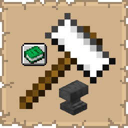

# Anvil Enchantment Ordering Guide

  

   
A mod that embeds an enchantment merge optimizer directly into the vanilla Anvil GUI.

## Functionality

  

   
When you open an anvil, a guide button appears on the left side of the GUI. Clicking it opens a three-phase panel:
 
- Phase 1 (Item Selection): Choose the item type you want to enchant (sword, chestplate, pickaxe, bow, etc.). Toggle between optimizing for Least XP/Levels or Least Prior Work Penalty.
- Phase 2 (Enchantment Selection): Select which enchantments and levels you want on the item. Incompatible enchants are automatically grouped.
- Phase 3: (Step-by-Step Tree): The optimizer computes the cheapest merge order and displays it as an interactive tree. Each node shows the item or book involved, its enchantments, merge cost, prior work penalty, and — for the final node — the total cost. Hover any node for full details. If you already have a matching item in your inventory, the frame shows your actual item instead of the generic icon.

## Benefits

  

   
- Eliminates guesswork when combining enchantments at the anvil.
- Brute-force searches all possible merge orderings to find the true optimal sequence.
- Saves significant XP by avoiding suboptimal anvil chains caused by prior work penalties.
- Supports two optimization modes so you can prioritize either total levels spent or long-term reusability of the item.

## Installation

  

   
1.  **Requirements**: Ensure you have Minecraft 1.21.11, Fabric Loader 0.18.4, and the Fabric API installed.
2.  **Download**: Get the latest `.jar` from [Modrinth](https://modrinth.com/mod/anvil-enchantment-ordering-guide) or [CurseForge](https://www.curseforge.com/minecraft/mc-mods/anvil-enchantment-ordering-guide).
3.  **Setup**: Drop the file into your `%appdata%/.minecraft/mods` folder.

## Acknowledgements
   
The enchantment merge optimization logic used in this mod is based on the work found at https://github.com/iamcal/enchant-order. A sincere thank you to the author [iamcal](https://github.com/iamcal) for allowing the use of their logic in this project.

## Support

  

   
If you encounter bugs or wish to contribute:
* [Report any problems you find.](https://github.com/armaninyow/Anvil-Enchantment-Ordering-Guide/discussions/categories/issues)
* [Share your ideas for new features.](https://github.com/armaninyow/Anvil-Enchantment-Ordering-Guide/discussions/categories/suggestions)

## Credits

  

   
* **Author**: Armaninyow
* **License**: Released under [CC0-1.0](https://creativecommons.org/publicdomain/zero/1.0/).

